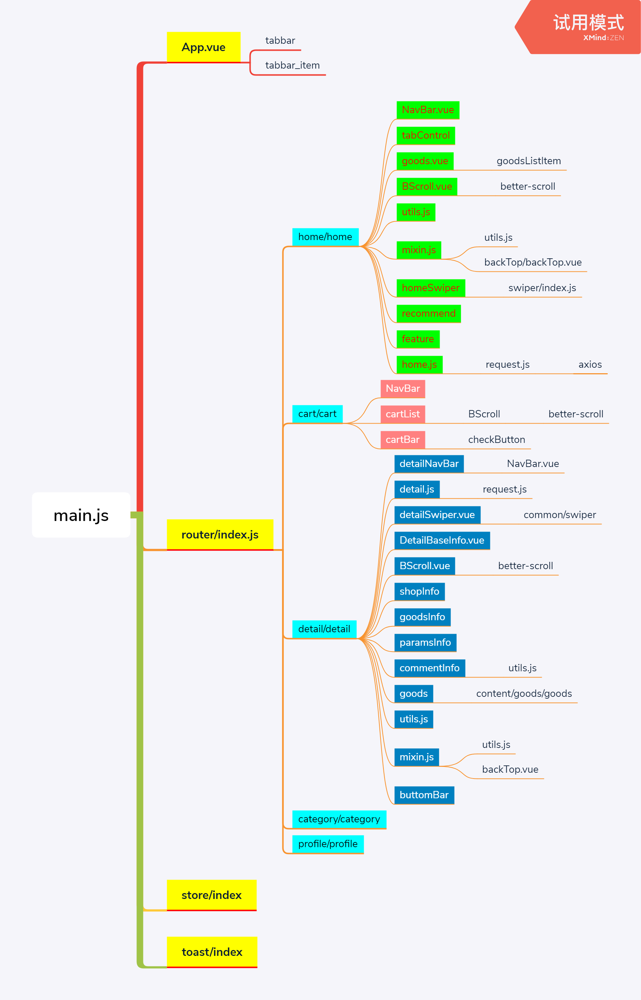

### 文件结构图



### 父子组件的数据传递

##### 父组件向子组件传递数据

1. 在子组件中的props中定义变量用来接收父组件传递的数据

```javascript

//子组件内容(以homeSwiper.vue文件为例)
props:{
    banners:{//banners是用来接收父组件数据的变量
      type:Array,//允许接受的数据类型
      default(){//父组件没有传入数据时调用该方法
        return[]//默认返回的数据
      }
    }
}
```

2. 在父组件中将需要传递的数据通过bind指令绑定到子组件上

```html

<!-- 父亲组件内容(以homeSwiper.vue文件为例) -->
<home-swiper :banners="banners" @swiperImageLoad="swiperImageLoad"></home-swiper>
<!-- 冒号后面的值负责接收父组件传递过来的数据，也就是子组件中对应的props里的值 -->
```

```javascript

data(){
    return{
      banners:[]//要传递的数据，初始值为空，但是一般会通过一些方法添加数据
    }
}
```

##### 子组件向父组件传值(以tabControl.vue向home.vue传值为例)

1. 在子组件通过$emit触发监听的自定义事件并为回调函数传入参数

```html

<!-- 以下是子组件内容 -->
<div ...  @click="itemClick(index)" :key="index">
    ...
    
</div>
```

```javascript

methods:{
itemClick(index){
      this.currentIndex=index;
      this.$emit("tabClick",index);
    }
}
```

2. 为要监听的自定义事件添加回调函数

```html

<!-- 以下是父组件内容 -->
<tab-control ... @tabClick="tabClick" ...></tab-control>
@符号负责监听自定义事件tabClick(也就是@后紧跟的值)，他的值是要回调的方法(也就是引号中的值)，并且这个值会接收emit传入的参数
```

```javascript

methods:{
    tabClick(index){
        ....
      }
}
```

### 混入的使用

1. 将组件共有的方法或变量单独抽离到一个js文件中并导出

2. 组件需要使用混入文件中的数据时将其导入

```javascript

import {itemImageLoadMixin,backTopMixin} from "../../common/mixin.js"
```

3. 通过mixins将导入的文件里的方法添加到当前组件

```javascript
mixins:[itemImageLoadMixin,backTopMixin]mixin.js"
```

> 如果你的混入包含一个钩子而创建组件本身也有一个，两个函数将先后被调用。详情参见：[mixins](https://cn.vuejs.org/v2/api/#mixins)

之后就可在组件内正常使用导入的方法了

### toast的使用

1. 先将toast的功能单独封装好，并将其添加到Vue原型中

2. 将toast的index文件引入main文件中并用use方法调用

3. 这样在任何地方都可以通过this.$toast调用toast

> 之所以可以在任何地方调用$oast是因为他已经添加到了vue原型中

> 个人认为toast实际上就是一个自定义插件

### BetterScroll

1. 使用BetterScroll时必须要给滚动区域一个固定的高度

2. 容器内只允许有一个子节点

### 事件总线
[事件总线](https://www.jianshu.com/p/4fa3bf211785)

> 事件总线适合于那些没有关系但又需要通信的组件，但很多情况下我们又不想使用复杂的vuex，这时事件总线就比较合适了